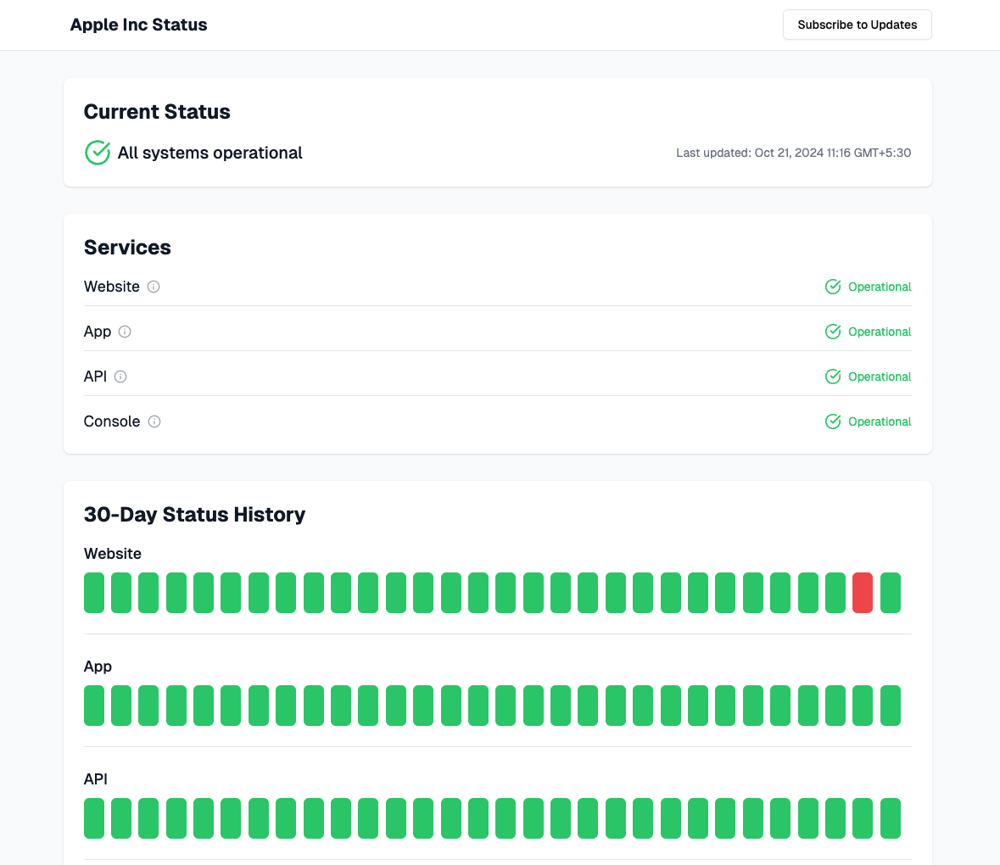

# HeyStatus

HeyStatus is an open-source status page system designed to help teams monitor their services and communicate effectively with users about incidents and maintenance. Built with modern web technologies, it offers real-time updates, customizable status pages, and comprehensive incident management features.




## Table of Contents

- [HeyStatus](#heystatus)
  - [Table of Contents](#table-of-contents)
  - [Features](#features)
  - [Tech Stack](#tech-stack)
  - [Architecture](#architecture)
  - [Key Components](#key-components)
    - [Real-time Updates](#real-time-updates)
    - [Incident Management](#incident-management)
    - [Multi-tenant Architecture](#multi-tenant-architecture)
    - [Team Management and Permissions](#team-management-and-permissions)
    - [Status Heatmap](#status-heatmap)
    - [Data Fetching Strategy](#data-fetching-strategy)
  - [Local Development Setup](#local-development-setup)
  - [Continuous Integration and Deployment (CI/CD)](#continuous-integration-and-deployment-cicd)
    - [Deployment Process](#deployment-process)
    - [Environment Variables](#environment-variables)
  - [Edge Functions](#edge-functions)
    - [1. Send Mail to Subscribers](#1-send-mail-to-subscribers)
    - [2. Accept Invitation](#2-accept-invitation)
  - [License](#license)

## Features

- **Customizable Status Pages**: Create public-facing status pages for your services.
- **Service Management**: Add, update, and monitor multiple services.
- **Incident Management**: Create, update, and resolve incidents efficiently. Add updated to existing services with public message.
- **Automatic Service Status Updates**: Based on incident status and impact HeyStatus intelligently suggest status for related systems.
- **Scheduled Maintenance**: Plan and communicate scheduled maintenance to users.
- **Real-time Updates**: Status changes are pushed to public status page in real-time via WebSocket.
- **Team Collaboration**: Invite team members and manage roles (Admin, Editor, Viewer).
- **Email Notifications**: Subscribers receive email notifications for incident updates.
- **Multi-tenant Architecture**: Support for multiple organizations.
- **Analytics**: View uptime statistics and incident history.
- **JSON API**: Access organization status data programmatically via a JSON API endpoint (e.g., `https://hey-status.pages.dev/api/apple/status`).

## Tech Stack

- **Frontend**: React with Remix.js
- **Backend**: Supabase (PostgreSQL database + serverless functions)
- **Language**: TypeScript
- **Styling**: TailwindCSS with Shadcn/ui components
- **State Management**: React Query
- **Form Handling**: React Hook Form with Zod validation
- **Authentication**: Supabase Auth (Google OAuth)
- **Deployment**: Cloudflare Pages (frontend) and Supabase (backend)
- **Subscriber Emails**: Resend

## Architecture

HeyStatus follows a modern serverless architecture:

1. **Frontend**: The Remix.js application is deployed on Cloudflare Pages, providing a fast and responsive user interface.

2. **Backend**: Supabase provides the backend infrastructure:
   - PostgreSQL database for data storage
   - Realtime subscriptions for live updates
   - Row Level Security (RLS) for data access control
   - Serverless functions for complex operations

3. **Authentication**: Supabase Auth handles user authentication, supporting Google OAuth.

4. **API**: The frontend communicates with Supabase using the `@supabase/supabase-js` client library.

5. **State Management**: React Query is used for data state management, providing caching and synchronization.

6. **Email Notifications**: A Supabase Edge Function integrates with Resend for sending email notifications.

## Key Components

### Real-time Updates

Real-time updates are implemented using Supabase's Realtime feature:

1. The page is initally rendered on server with the latest data and sent to client. This is to ensure that initial page load is fast, prepopulated with data and SEO optimized.
2. On client, react takes over and subscribes to relevant tables (e.g., `services`, `incidents`) using Supabase's `subscribe()` method.
3. When data changes in these tables, Supabase sends events to the subscribed clients.
4. `useEffect` hook is configured to update the local state when these events are received, updating the UI in real-time.
```
useEffect(() => {
  const subscription = supabase
    .channel("public:services")
    .on(
      "postgres_changes",
      { event: "", schema: "public", table: "services" },
      (payload) => {
        // Handle the change
      }
    )
    .subscribe();
  return () => {
    subscription.unsubscribe();
  };
}, [supabase, queryClient]);

```


### Incident Management

The incident management system involves several components:

1. **Incident Creation**: Users can create incidents, specifying affected services, impact level, and initial status.
2. **Status Updates**: Team members can add updates to incidents, changing the status and providing additional information.
3. **Service Status Sync**: When an incident is updated, the affected services' statuses are optionally updated to reflect the current situation.
4. **Subscriber Notifications**: A Supabase trigger invokes an Edge Function to send email notifications to subscribers when an incident is updated.

### Multi-tenant Architecture

HeyStatus supports multiple organizations:

1. Each organization has a unique slug used in the public status page URL.
2. Row Level Security (RLS) policies in Supabase ensure that users can only access data related to their organization.
3. The `organizations` table stores organization details, and users are associated with an organization through the `users` table.

### Team Management and Permissions

The system supports different user roles:

1. **Admin**: Can manage team members, edit organization settings, and perform all actions.
2. **Editor**: Can create and manage incidents, services, and maintenance schedules.
3. **Viewer**: Can view the dashboard and incidents but cannot make changes.

Roles are enforced through RLS policies in Supabase, ensuring data security at the database level.

### Status Heatmap

HeyStatus includes a Status Heatmap feature that provides a visual representation of service uptime over the past 30 days. Here's how it works:

1. **Data Collection**: The system continuously logs service status changes in the `service_status_logs` table.

2. **Data Processing**: When rendering the heatmap, the system:
   - Fetches status logs for the last 30 days
   - Calculates daily downtime for each service
   - Determines the appropriate color for each day based on downtime duration

3. **Visualization**: The heatmap is rendered as a grid, where:
   - Each row represents a service
   - Each column represents a day
   - Cell colors indicate the service status (green for operational, various shades of red for issues)

4. **Interactivity**: Users can hover over cells to see detailed information about service status for that specific day.

This feature provides a quick, at-a-glance view of service reliability over time, helping teams identify patterns and potential issues.

### Data Fetching Strategy

HeyStatus employs a hybrid approach to data fetching, combining Remix loaders with React Query for optimal performance and user experience:

**Remix Loaders**
- Used for initial data fetching on the server side
- Ensures that the initial page load is fast and comes pre-populated with data
- Improves SEO as the content is available in the initial HTML


**React Query**
- Used for client-side data fetching and state management
- Provides caching, background updates, and real-time synchronization
- Seamlessly integrates with Remix by using the loader data as initial query data


### JSON API

HeyStatus provides a JSON API endpoint for programmatic access to organization status data:

- **Endpoint**: `/api/:organizationSlug/status` (e.g., `https://hey-status.pages.dev/api/apple/status`)
- **Method**: GET
- **Response**: JSON object containing:
  - Organization details
  - Overall status
  - List of services with their current status
  - Active incidents
  - Upcoming scheduled maintenances

This API allows developers to integrate HeyStatus data into their own applications or monitoring systems easily. The data is cached for 60 seconds to reduce database load for frequent requests.

## Local Development Setup

1. **Prerequisites**:
   - Node.js (v18 or later)
   - Bun (recommended) or npm
   - Supabase CLI
   - Git
   - Docker (recommended OrbStack)

2. **Clone the repository**:
   ```
   git clone https://github.com/kishanthik/hey-status.git
   cd hey-status
   ```

3. **Install dependencies**:
   With Bun (recommended):
   ```
   bun install
   ```
   Or with npm:
   ```
   npm install
   ```

4. **Set up Supabase locally**:
   - Make sure docker is installed on your system.
   - Install Supabase CLI: `brew install supabase/tap/supabase`
   - Start Supabase: `supabase start`
   - This will create a local Supabase instance and apply migrations
   - Run edge functions locally using: `supabase functions serve`

5. **Configure environment variables**:
   - Copy `.dev.vars.example` to `.dev.vars`
   - Update the Supabase URL and anon key with the values provided by `supabase start`
   - For email sending edge functions: copy `/supabase/functions/.env.example` to `/supabase/functions/.env`
   - Add Resend API key in it.
6. **Run the development server**:
   With Bun:
   ```
   bun run dev
   ```
   Or with npm:
   ```
   npm run dev
   ```

7. **Open the application**:
   Visit `http://localhost:5173` in your browser


Now you have HeyStatus running locally on your machine!


## Continuous Integration and Deployment (CI/CD)

HeyStatus uses GitHub Actions for continuous integration and deployment. The workflow is defined in `.github/workflows/production.yml`.

### Deployment Process

1. **Trigger**: The workflow is triggered on pushes to the `main` branch or manually via workflow dispatch.

2. **Environment**: The job runs on the latest Ubuntu runner.

3. **Steps**:
   - Checkout the repository
   - Set up Supabase CLI
   - Link the Supabase project
   - Push database changes using `supabase db push`
   - Deploy Edge Functions

### Environment Variables

The workflow uses the following secrets:
- `SUPABASE_ACCESS_TOKEN`
- `PRODUCTION_DB_PASSWORD`
- `PRODUCTION_PROJECT_ID`

These secrets are securely stored in GitHub and used during the deployment process.

## Edge Functions

HeyStatus utilizes Supabase Edge Functions for certain operations that require server-side logic. Two key edge functions are:

### 1. Send Mail to Subscribers

This function is triggered when a new incident update is created. It fetches the relevant incident and organization details, then sends an email notification to all subscribers of that organization using Resend.

### 2. Accept Invitation

The invitation acceptance process is handled by an edge function to ensure security and proper data manipulation. Here's how it works:

1. When a user clicks on an invitation link, the frontend calls this edge function.
2. The function verifies the invitation's validity (correct email, not expired).
3. If valid, it updates the user's organization and role in the database.
4. The invitation is then deleted to prevent reuse.

This approach ensures that sensitive operations like changing a user's organization are performed securely on the server-side.

To deploy edge functions locally for testing:
```
supabase functions serve
```

For production deployment, edge functions are automatically deployed as part of the GitHub Actions workflow.

## License

HeyStatus is open-source software licensed under the MIT license.