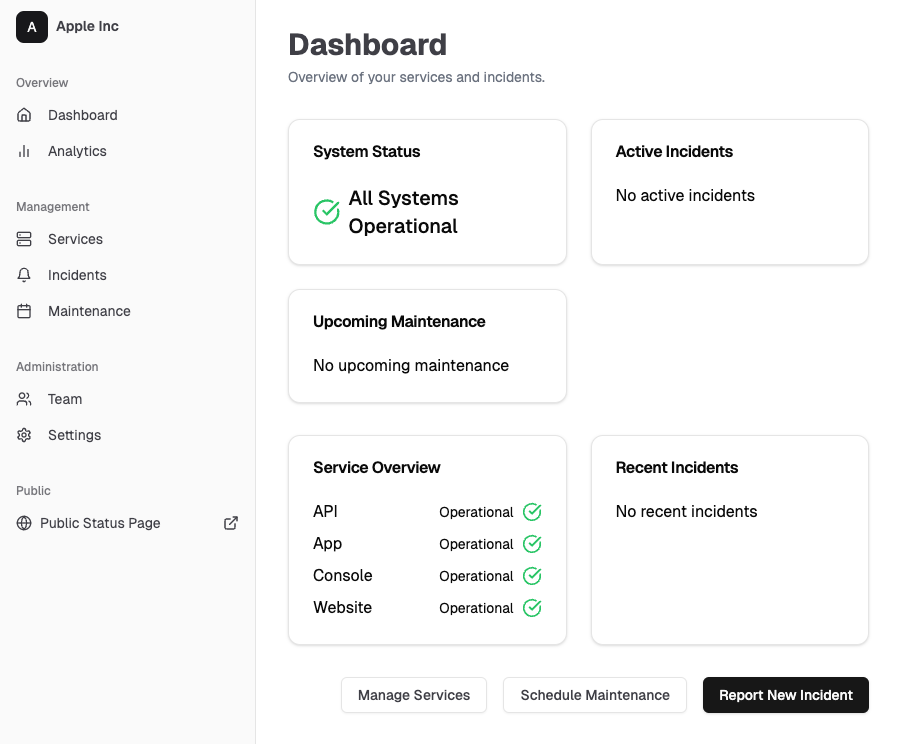

# HeyStatus

HeyStatus is an open-source status page system designed to help teams monitor their services and communicate effectively with users about incidents and maintenance. Built with modern web technologies, it offers real-time updates, customizable status pages, and comprehensive incident management features.




## Table of Contents

- [HeyStatus](#heystatus)
  - [Table of Contents](#table-of-contents)
  - [Features](#features)
  - [Tech Stack](#tech-stack)
  - [Architecture](#architecture)
  - [Key Components](#key-components)
    - [Real-time Updates](#real-time-updates)
    - [Incident Management](#incident-management)
    - [Multi-tenant Architecture](#multi-tenant-architecture)
    - [Team Management and Permissions](#team-management-and-permissions)
  - [Local Development Setup](#local-development-setup)
  - [License](#license)

## Features

- **Customizable Status Pages**: Create public-facing status pages for your services.
- **Service Management**: Add, update, and monitor multiple services.
- **Incident Management**: Create, update, and resolve incidents efficiently. Add updated to existing services with public message.
- **Automatic Service Status Updates**: Based on incident status and impact HeyStatus intelligently suggest status for related systems.
- **Scheduled Maintenance**: Plan and communicate scheduled maintenance to users.
- **Real-time Updates**: Status changes are pushed to public status page in real-time via WebSocket.
- **Team Collaboration**: Invite team members and manage roles (Admin, Editor, Viewer).
- **Email Notifications**: Subscribers receive email notifications for incident updates.
- **Multi-tenant Architecture**: Support for multiple organizations.
- **Analytics**: View uptime statistics and incident history.

## Tech Stack

- **Frontend**: React with Remix.js
- **Backend**: Supabase (PostgreSQL database + serverless functions)
- **Language**: TypeScript
- **Styling**: TailwindCSS with Shadcn/ui components
- **State Management**: React Query
- **Form Handling**: React Hook Form with Zod validation
- **Authentication**: Supabase Auth (Google OAuth)
- **Deployment**: Cloudflare Pages (frontend) and Supabase (backend)
- **Subscriber Emails**: Resend

## Architecture

HeyStatus follows a modern serverless architecture:

1. **Frontend**: The Remix.js application is deployed on Cloudflare Pages, providing a fast and responsive user interface.

2. **Backend**: Supabase provides the backend infrastructure:
   - PostgreSQL database for data storage
   - Realtime subscriptions for live updates
   - Row Level Security (RLS) for data access control
   - Serverless functions for complex operations

3. **Authentication**: Supabase Auth handles user authentication, supporting Google OAuth.

4. **API**: The frontend communicates with Supabase using the `@supabase/supabase-js` client library.

5. **State Management**: React Query is used for data state management, providing caching and synchronization.

6. **Email Notifications**: A Supabase Edge Function integrates with Resend for sending email notifications.

## Key Components

### Real-time Updates

Real-time updates are implemented using Supabase's Realtime feature:

1. The page is initally rendered on server with the latest data and sent to client. This is to ensure that initial page load is fast, prepopulated with data and SEO optimized.
2. On client, react takes over and subscribes to relevant tables (e.g., `services`, `incidents`) using Supabase's `subscribe()` method.
3. When data changes in these tables, Supabase sends events to the subscribed clients.
4. `useEffect` hook is configured to update the local state when these events are received, updating the UI in real-time.
```
useEffect(() => {
  const subscription = supabase
    .channel("public:services")
    .on(
      "postgres_changes",
      { event: "", schema: "public", table: "services" },
      (payload) => {
        // Handle the change
      }
    )
    .subscribe();
  return () => {
    subscription.unsubscribe();
  };
}, [supabase, queryClient]);

```


### Incident Management

The incident management system involves several components:

1. **Incident Creation**: Users can create incidents, specifying affected services, impact level, and initial status.
2. **Status Updates**: Team members can add updates to incidents, changing the status and providing additional information.
3. **Service Status Sync**: When an incident is updated, the affected services' statuses are optionally updated to reflect the current situation.
4. **Subscriber Notifications**: A Supabase trigger invokes an Edge Function to send email notifications to subscribers when an incident is updated.

### Multi-tenant Architecture

HeyStatus supports multiple organizations:

1. Each organization has a unique slug used in the public status page URL.
2. Row Level Security (RLS) policies in Supabase ensure that users can only access data related to their organization.
3. The `organizations` table stores organization details, and users are associated with an organization through the `users` table.

### Team Management and Permissions

The system supports different user roles:

1. **Admin**: Can manage team members, edit organization settings, and perform all actions.
2. **Editor**: Can create and manage incidents, services, and maintenance schedules.
3. **Viewer**: Can view the dashboard and incidents but cannot make changes.

Roles are enforced through RLS policies in Supabase, ensuring data security at the database level.

## Local Development Setup

1. **Prerequisites**:
   - Node.js (v18 or later)
   - Bun (recommended) or npm
   - Supabase CLI
   - Git
   - Docker (recommended OrbStack)

2. **Clone the repository**:
   ```
   git clone https://github.com/kishanthik/hey-status.git
   cd hey-status
   ```

3. **Install dependencies**:
   With Bun (recommended):
   ```
   bun install
   ```
   Or with npm:
   ```
   npm install
   ```

4. **Set up Supabase locally**:
   - Make sure docker is installed on your system.
   - Install Supabase CLI: `brew install supabase/tap/supabase`
   - Start Supabase: `supabase start`
   - This will create a local Supabase instance and apply migrations
   - Run edge functions locally using: `supabase functions serve`

5. **Configure environment variables**:
   - Copy `.dev.vars.example` to `.dev.vars`
   - Update the Supabase URL and anon key with the values provided by `supabase start`
   - For email sending edge functions: copy `/supabase/functions/.env.example` to `/supabase/functions/.env`
   - Add Resend API key in it.
6. **Run the development server**:
   With Bun:
   ```
   bun run dev
   ```
   Or with npm:
   ```
   npm run dev
   ```

7. **Open the application**:
   Visit `http://localhost:5173` in your browser


Now you have HeyStatus running locally on your machine!
## License

HeyStatus is open-source software licensed under the MIT license.